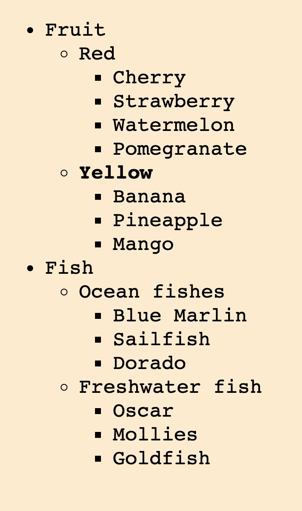
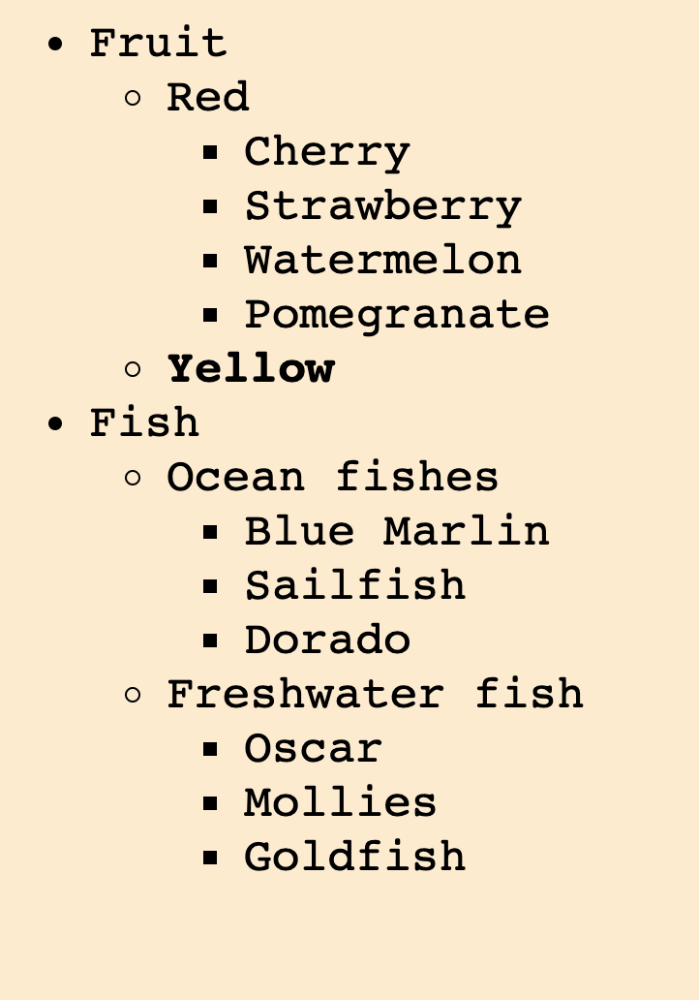

1. Replace `<your_account>` with your Github username in the link
    - [DEMO LINK](https://MaximTsyhanenko.github.io/js_sliding-tree-DOM/)
2. Follow [this instructions](https://mate-academy.github.io/layout_task-guideline/)
    - Run `npm run test` command to test your code;
    - Run `npm run test:only -- -n` to run fast test ignoring linter;
    - Run `npm run test:only -- -l` to run fast test with additional info in console ignoring linter.

### Task: Sliding tree

Create an expandable tree.

Requirements: 
- Clicking on the headline should hide or show elements.
- Clicking outside the title text (in an empty place) should do nothing.

Hint: you need to wrap each header text into `span` tag.

Do not change HTML or CSS in this task.

### Screenshot of the tree

