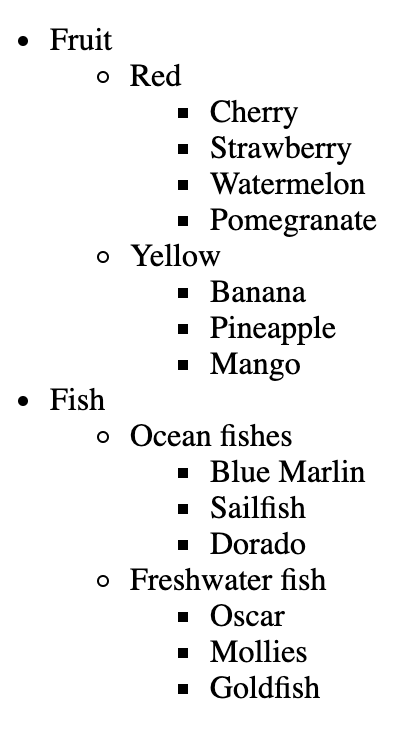
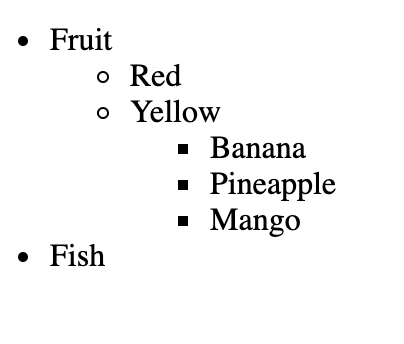

# Sliding tree

## Task

Create an expandable tree.

Requirements: 

- Use delegation.
- Clicking on the headline should hide or show elements (as in the screenshots).
- Clicking outside the title text (in an empty place) should do nothing.
- When you hover the title - it becomes bold, implemented through CSS.

### Screenshot of the tree

---
**Read the guideline before start**

[Guideline](https://github.com/mate-academy/js_task-DOM-guideline)

**Result**

- [UPDATE DEMO LINK](https://nazardovhanchuk.github.io/js_sliding-tree-DOM/)
